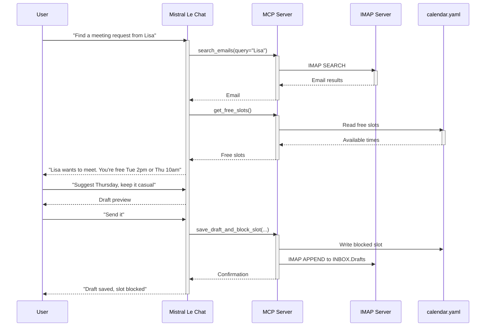

# Meeting Scheduler MCP

Natural Language Meeting Scheduling with Personal Touch

## The Problem with Scheduling Tools

Traditional scheduling tools like Calendly and Cal.com feel transactional for important contacts:

- Impersonal: Automated links lack human touch
- Manual Hell: Calendar tab-switching between email and scheduling apps
- Context Loss: No integration with email conversations

Our Goal: Natural language scheduling that feels personal and integrates seamlessly with your email workflow.

## What We're Building

A Mistral Le Chat powered meeting scheduler that combines:

- Email Search: Find meeting requests in your inbox
- Calendar Management: YAML-based scheduling with holidays support
- Natural Language Interface: Chat-based scheduling workflow
- Email Threading: Maintain conversation context with proper email headers

### Architecture Overview



## Tech Stack

- Backend: Python 3.13+ with FastMCP
- Email Integration: IMAP with TLS/SSL support
- Calendar Storage: YAML file-based system
- Transport: HTTP/SSE for Mistral connector
- Data Models: Pydantic v2 for validation

## Features

### 1. Email Integration

- IMAP Search: Find emails by criteria (sender, subject, etc.)
- Email Threading: Maintain conversation context with Message-ID, In-Reply-To, References
- Draft Management: Save email drafts with proper threading headers
- TLS/SSL Support: Secure connections with configurable SSL options

### 2. Calendar Management

- YAML Configuration: Simple, human-readable calendar format
- Weekly Availability: Define working hours and available slots
- Holiday Support: Automatic holiday detection (country-specific)
- Time Zone Awareness: Full timezone support with ZoneInfo
- Slot Finding: Intelligent free slot detection

### 3. Natural Language Workflow

1. Find Requests: "Find meeting requests from Lisa"
2. Get Availability: "What times am I free this week?"
3. Suggest Times: "Suggest Thursday morning"
4. Confirm & Block: "Confirm the meeting and block the slot"

## Getting Started

### Prerequisites

- Python 3.13+
- IMAP-enabled email account
- Mistral Le Chat integration

### Installation

```bash
# Clone the repository
uv add git+https://github.com/your-repo/meeting-scheduler-mcp.git

# Install dependencies
uv sync

# Set up environment variables
cp .env.example .env
# Edit .env with your IMAP credentials
```

### Configuration

Create a `.env` file with your IMAP settings:

```env
# Required settings
IMAP_HOST=imap.example.com      # IMAP server hostname
IMAP_USER=your@email.com        # IMAP username/email
IMAP_PASSWORD=secure_password   # IMAP password
IMAP_FROM=your@email.com        # From address for sent emails

# TLS/SSL Configuration (optional with sensible defaults)
IMAP_PORT=993                  # IMAP port
IMAP_USE_SSL=true              # Use SSL/TLS
IMAP_USE_STARTTLS=false        # Use STARTTLS
IMAP_VERIFY_SSL=true           # Verify SSL certificates
```

### Calendar Configuration

Edit `calendar.yaml` to define your availability:

```yaml
schedule:
  timezone: Europe/Berlin
  slot_duration: 30
  holidays: DE
  weekly:
    - days:
        - mon
        - tue
        - wed
        - thu
        - fri
      slots:
        - start: 09:00:00
          end: "12:00:00"
        - start: "13:00:00"
          end: "17:00:00"
blocked: []
```

### Running the Server

```bash
# Start the FastMCP server with Python module syntax
uv run python -m meeting_scheduler_mcp

# Server will be available at http://0.0.0.0:8000
```

## API Tools

### 1. `search_emails_tool`

Search emails with full metadata and threading support:

```python
emails = search_emails_tool(
    mailbox="INBOX",
    criteria="FROM 'lisa@example.com'"
)
```

### 2. `get_free_slots`

Get available time slots:

```python
free_slots = get_free_slots()
# Returns: [{date: "2024-12-10", start: "10:00", end: "10:30", timezone: "Europe/Berlin"}, ...]
```

### 3. `save_draft_tool`

Save email drafts with threading:

```python
result = save_draft_tool(
    subject="Meeting Confirmation",
    body="Let's meet on Thursday at 10am",
    to="lisa@example.com",
    in_reply_to="<original-message-id>"
)
```

### 4. `save_draft_and_block_slot`

Complete workflow: block slot + save confirmation:

```python
result = save_draft_and_block_slot(
    slot_index=0,
    subject="Meeting Confirmed",
    body="Your meeting is confirmed for Thursday 10am",
    to="lisa@example.com",
    in_reply_to="<original-message-id>"
)
```

## Testing

### Unit Tests

Run tests with:

```bash
uv run pytest
```

### Integration Tests with Docker Compose

For IMAP integration testing, use Docker Compose with Greenmail:

```bash
# Start Greenmail IMAP server
cd .devcontainer
docker-compose up -d greenmail

# Seed test emails
uv run python scripts/seed_test_emails.py

# Run tests with test configuration
IMAP_CONFIG=.env.test uv run pytest tests/test_integration.py
```

### Test Coverage

Run tests with coverage:

```bash
uv run pytest --cov=meeting_scheduler_mcp --cov-report=term-missing
```

## Contributing

Contributions welcome! Please follow:

- **Code Style**: Ruff linting rules
- **Type Safety**: Full Pydantic v2 typing
- **Testing**: Comprehensive pytest coverage
- **Documentation**: Keep README updated

## License

MIT License - See [LICENSE](LICENSE) for details.

## Learn More

- [FastMCP Documentation](https://fastmcp.com)
- [Pydantic v2](https://pydantic.dev)
- [IMAP Protocol](https://tools.ietf.org/html/rfc3501)
